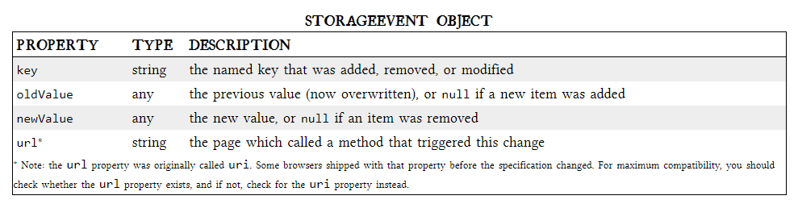

# LOCAL STORAGE

For native applications, the operating system typically provides an abstraction layer for storing and retrieving application-specific data like preferences or runtime state.    

### Cookies (included with every HTTP request)  
> slowing down your web application by needlessly transmitting the same data over and over   
> thereby sending data unencrypted over the internet (unless your entire web application is served over SSL)   
> limited to about 4 KB of data — enough to slow down your application (see above), but not enough to be terribly useful   

### HTML5 STORAGE    

> it’s a way for web pages to store named key/value pairs locally, within the client web browser. Like cookies, this data persists even after you navigate away from the web site, close your browser tab, exit your browser, or what have you, it is implemented natively in web browsers, so it is available even when third-party browser plugins are not.    

to use HTML5 STORAGE from browser you should check it first by js :

>`function supports_html5_storage() {`   
>  `try {`   
>    `return 'localStorage' in window && window['localStorage'] !== null;`   
>  `} catch (e) {`   
>    `return false;`   
>`  }`   
>` }`   

all that can replace by :   
>
> `Modernizr.localstorage`  
>

### USING HTML5 STORAGE
* If you are storing and retrieving anything other than strings, you will need to use functions like `parseInt()` or `parseFloat()` to coerce your retrieved data into the expected JavaScript datatype.  

* Calling a named key that already exists will silently overwrite the previous value `setItem()` 

* Calling a non-existent key will return null rather than throw an exception `getItem()`   

or using `["bar"]` insted of both `setItem()` &  `getItem()`    

*  for removing the value for a given named key, and clearing the entire storage area  
`interface Storage {`   
  `deleter void removeItem(in DOMString key);`   
  `void clear();`   
`};`  

* Calling with a non-existent key will do nothing `removeItem()`    

### TRACKING CHANGES TO THE HTML5 STORAGE AREA   
Therefore, to hook the storage event, you’ll need to check which event mechanism the browser supports. If you prefer to use jQuery or some other JavaScript library to register your event handlers, you can do that with the storage event.    

The handle_storage callback function will be called with a StorageEvent object, except in Internet Explorer   

`function handle_storage(e) {`  
  `if (!e) { e = window.event; }`  
`}`   

    
> quoted from [HTML5doctor](http://diveinto.html5doctor.com/storage.html)    

HTML5 STORAGE IN ACTION
