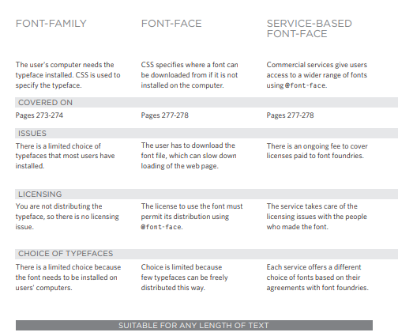
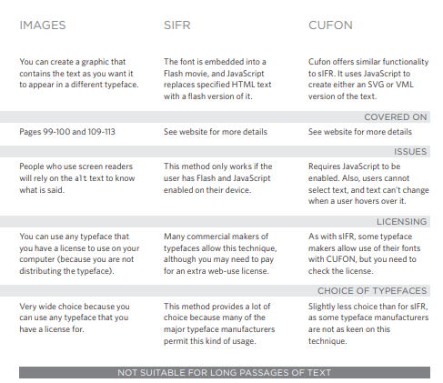
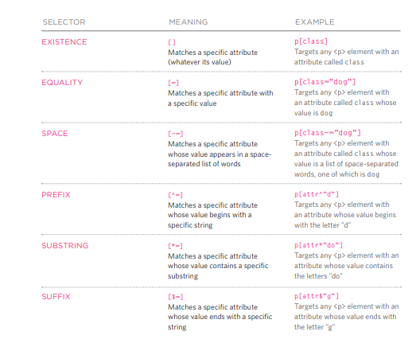

# Images

Imeges used in your website should be elegible.  

here some websites you can get a stock photos from it:  
> [istockphoto website](www.istockphoto.com)  
> [gettyimages website](www.gettyimages.com)  
> [veer website](www.veer.com)  
> [sxc website](www.sxc.hu)  
> [fotolia website](www.fotolia.com)  
> quoted from Ductte html book  

### Adding Images  

you should use this code to tag the img:  
>
> ``  
>

### Height & Width of Images  

 you can use this code to manage img height and width  
>
> ``   
>

### Aligning Images Horizontally   
you can use this code to decid how other parts of the page folw around the img horizantly:   
>
> ``   
>

### Aligning Images Vertically  
you can use this code to decid how other parts of the page folw around the img vertically:    
> 
> ``   
>

### Figure and Figure Caption  
>
> `<figure>`  
> tag to contain img and it's caption  
>
> `<figcaption>`  
> contains the img caption  
>

-----------------------------------

# Color

to use color we can indicate it by several ways:

* rgb values  
* hex codes  
* color names  
* HSL Colors  `hsl, hsla`   

# Text

* Techniques That Offer a Wider Choice of Typefaces   

### Windows 

    
> quoted from Ductte html book  

### Mac

    
> quoted from Ductte html book 

| proparity name        | code                                                                       |  
| --------------------- | -------------------------------------------------------------------------- |
| Specifying Typefaces  | `font-family`                                                              |  
| Size of Type          | `font-size`                                                                |  
| Font Choice           | `@font-face`                                                               |  
| Bold                  | `font-weight  (normal,bold)`                                               |  
| Italic                | `font-style(normal,italic,oblique)`                                        |  
| UpperCase & LowerCase | `text-transform(uppercase,lowercase,capitalize)`                           |  
| Underline & Strike    | `text-decoration(none,underline,overline,line-through,blink)`              |  
| Leading               | `line-height`                                                              |  
| Letter & Word Spacing | `letter-spacing, word-spacing`                                             |  
| Alignment             | `text-align(left,right,center,justify)`                                    |  
| Vertical Alignment    | `vertical-align(baseline,sub,super,top,text-top,middle,bottom,text-bottom)`|  
| Indenting Text        | `text-indent`                                                              |  
| Drop Shadow           | `text-shadow`                                                              |  
| First Letter or Line  | `:first-letter, :first-line`                                               |  
| Styling Links         | `:link, :visited`                                                          |  
| Responding to Users   | `:hover, :active, :focus`                                                  |

### Attribute Selectors

    
> quoted from Ductte html book 

-------------------------

# JPEG vs PNG vs GIF

### JPEG     

> Use format for all images that contain a natural scene or photograph where variation in colour and intensity is smooth.

### PNG 

> Use PNG format for any image that needs transparency or for images with text & objects with sharp contrast edges like > logos

### GIF 

> Use GIF format for images that contain animations.