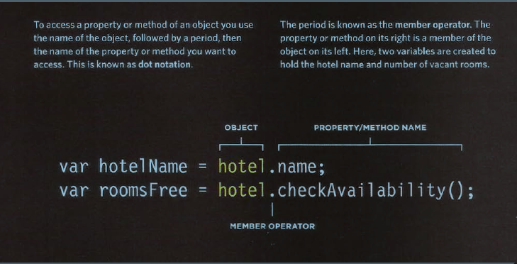
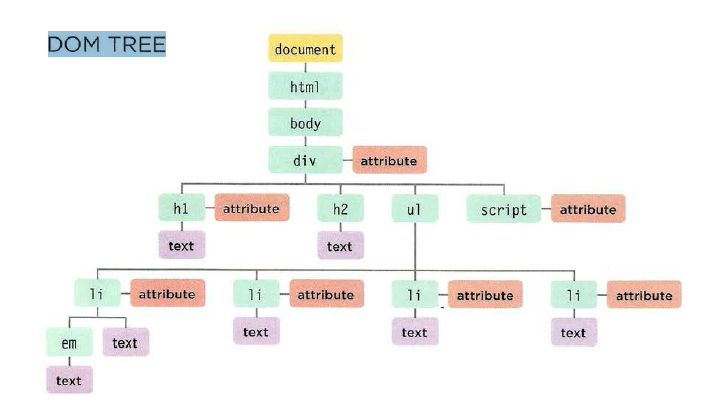
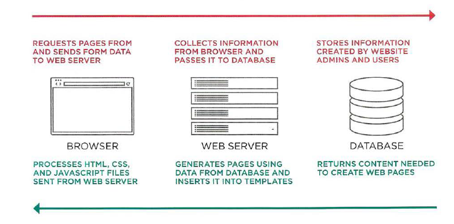
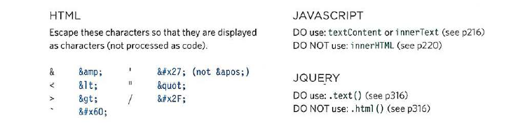
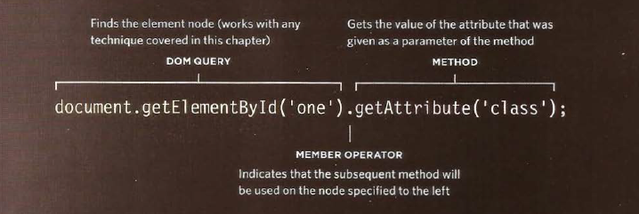

# What is the hardest thing about writing code?  

Writing code is putting the code with the purpose of building parts that we have taken out of the “bigger picture” of the problem domain.  

### how to make understanding of problem domain easy?  

> You can often make the problem domain easier by cutting out problem to peices  and make  your focus to a particular this  part of the problem, then asembly them togather to get your code.  

> sit with customers or business people who know about the problem domain to understand it well.  

# OBJECT  

Objects is a set of variables and functions togather creating a model of a something.    

> **variables** called in objects *property*   
> 
> **functions** called in objects *method*   

### Creating Object   

1. **Leteral notation**   

    
> quoted from Ductte JS book   

2. **Accessing an object and dot notation**     

    
> quoted from Ductte JS book   

3. **Constractor notation**    

    
> quoted from Ductte JS book    

# DOM    

Thats mean how browsers will create a model of an HTML page and how JavaScript can access and update the contents of a web page while it is in the browser window.    

### DOM cover:

> MAKING A MODEL OF THE HTML PAGE   
> WORK WITH THOSE ELEMENTS
> ACCESSING AND CHANGING THE HTML PAGE   

### DOM TREE   

    
> quoted from Ductte JS book   

### METHODS

**METHODS THAT RETURN A SINGLE ELEMENT NODE:**   

> `getElementByld('id')`   
> `querySel ector('css selector')`   
> `getEl ement sByClassName('class')`   
> `getEl ementsByTagName('tagName')`   
> `querySelectorAll ('css selector')`   

**RETURN MORE THAN ONE ELEMENT**   

> `getElementsByTagName('hl ' )`   
> `getElementsByTagName('li ')`   
> `getElementsByClassName('hot')`  
> `querySelectorA 11 ( ' l i [id] ' )`   

### TRAVERSING THE DOM    

* parentNode   
* previousSibling nextSibling   
* f i rstChild-lastChild    

### ADDING ELEMENTS USING DOM MANIPULATION    

> CREATE THE ELEMENT  `createEl ement ()`  
> GIVE IT CONTENT    `createTextNode()`  
> ADD IT TO THE DOM  `appendChild()`  

### REMOVING ELEMENTS VIA DOM MANIPULATION    

> STORE THE ELEMENT TO BE REMOVED IN A VARIABLE     
> STORE THE PARENT OF THAT ELEMENT IN A VARIABLE   
> REMOVE THE ELEMENT FROM ITS CONTA INING ELEMENT    

### UPDATING HTML CONTENT   

> `document.write()`   
> `element.innerHTML`    

### DEFENDING AGAINST CROSS-SITE SCRIPTING   

    
> quoted from Ductte JS book   

### VALIDATION & TEMPLATES Make   

* FILTER OR VALIDATE INPUT     
* LIMIT WHERE USER CONTENT GOES      

### ESCAPING & CONTROLLING MARKUP   

    
> quoted from Ductte JS book   

### Attribute nodes   

    
> quoted from Ductte JS book   