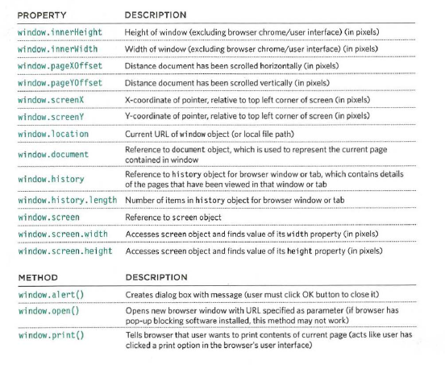

# Domain modeling  

is to create a conceptual model for a specific problem that can verify and validate the understanding of the problem.  

### tips to follow when building a domain models.  

> When modeling a single entity that'll have many instances, build self-contained objects with the same attributes and behaviors.  
> Model its attributes with a constructor function that defines and initializes properties.  
> Model its behaviors with small methods that focus on doing one job well.  
> Create instances using the new keyword followed by a call to a constructor function.  
> Store the newly created object in a variable so you can access its properties and methods from outside.  
> Use the this variable within methods so you can access the object's properties and methods from inside.  

# Tables in HTML   

#### Basic Table St ructure:   

`<table>`              `<table>` tag the overal contener of the table   
`<tr>`                 `<tr>` tag the start of each row   
`<td>15</td>`          `<td>`  tag each cell   
`<td>15</td>`  
`</tr>`  
`</table>`  

#### Table Headings   
`<th>`   

#### Long Tables   

`<thead>`   tags the heading    

`<tbody>`   the body set inside this element   

`<tfoot>`   the foot set inside this element    

#### Width & Spacing   

useing `width attribute` and `cellpadding attribute`   

#### Border & Background   

`<table border=" " bgcolor=" ">`

# Constractor notaion    

indevidual constractor notation

    
> quoted from Ductte JS book   

multi constractor notation

    
> quoted from Ductte JS book   

## RECAP:   

CREATE OBJECTS   
STORING DATA    

## WHAT ARE BUILT-IN OBJECTS?  

* THE BROWSER OBJECT MODEL:   

    
> quoted from Ductte JS book   

* THE DOCUMENT OBJECT MODEL:      
    
> quoted from Ductte JS book   

* GLOBAL OBJECTS:   

STRINGS: 

    
> quoted from Ductte JS book   

NUMBERS:   

    
> quoted from Ductte JS book   

MATH OBJECT:    

    
> quoted from Ductte JS book   

DATE OBJECT (AND TIME):     

    
> quoted from Ductte JS book   
