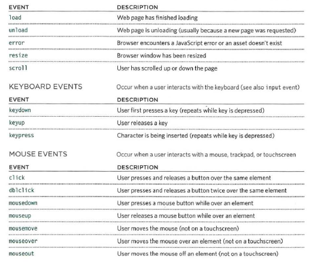
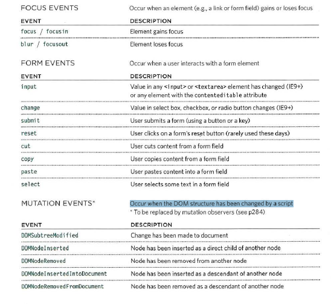

# Forms   

* Form Controls  
> ADDING TEXT   
> Making Choices   
> Submitting Forms   
>  Uploading Files    

 
* Form Structure  
`<form action="url"method="get">
.....
</form>`  

> Text input `<input type="text" name="username" size="15"maxlength="30" />`   
>
> Password Input ` <input type="password" name="password" size="15"maxlength="30" />`  
>
> Textarea  `<textarea name="comments" cols="20" rows="4">Enter your comments...</textarea>`  
>
> Radio Button `<input type="radio" name="genre" value="jazz" />`  
>
> Checkbox   `<input type="checkbox" name="service"value="spotify" />`  
>
> Drop Down List Box   
> `<select name="devices">`  
> `<option value="ipod">iPod</option>`  
> `<option value="radio">Radio</option>`  
> `<option value="computer">Computer</option>`  
> `</select>`  
>
> Multiple Select Box 
> `<select name="instruments" size="3"`  
> `multiple="multiple">`  
> `<option value="guitar" selected="selected">`  
> `Guitar</option>`  
> `<option value="drums">Drums</option>`   
> `<option value="keyboard"`  
> `selected="selected">Keyboard</option>`  
> `<option value="bass">Bass</option>`  
> `</select>`  
>
> File Input Box `<input type="file" name="user-song" />`  
>
> Submit Button `<input type="submit" name="subscribe"value="Subscribe" />`  
>
> Image Button `<input type="image" src="images/subscribe.jpg"width="100" height="20" />`  
>
> Button & hidden Controls `<button> Add</button>`  
>
> Labelling Form Controls `<label for="female">Female</label>`  
> 
> Grouping Form Elements   
> `<fieldset>`  
> `<legend>Contact details</legend>`  
> `<label>Email: `  
> `<input type="text" name="email" /></label> `  
> `<label>Mobile: `  
> `<input type="text" name="mobile" /></label> `  
> `<label>Telephone: `  
> `<input type="text" name="telephone" /></label>`  
> `</fieldset>`  
>

# Lists, Tables and Forms

|   tag                 |      code                               |
|-----------------------|-----------------------------------------------|
| Bullet Point Styles   | `list-style-type`                             |
| Images for Bullets    | `list-style-image`                            |
| Positioning the Marker| `list-style-position`                         |
| List Shorthand        | `list-style`                                  |
| Border on Empty Cells | `empty-cells`                                 |
| Gaps Between Cells    | `border-spacing, border-collapse`             |
| Cursor Styles         | `cursor`                                      |

# EVENTS   

* DIFFERENT EVENT TYPES   

**UIEVENTS** Occur when a user interacts with the browser's user interface (UI) rather than the web page   
**KEYBOARD EVENTS** Occur when a user interacts with the keyboard (see also input event)  
**MOUSE EVENTS** Occur when a user interacts with a mouse. trackpad, or touchscreen     
**FOCUS EVENTS** Occur when an element (e.g., a link or form field) gains or loses focus  
**FORM EVENTS** Occur when a user interacts with a form element   
**MUTATION EVENTS** Occur when the DOM structure has been changed by a script   

    
> quoted from Ductte JS book   

    
> quoted from Ductte JS book   

