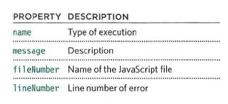
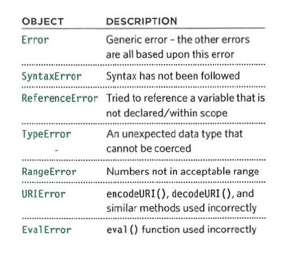
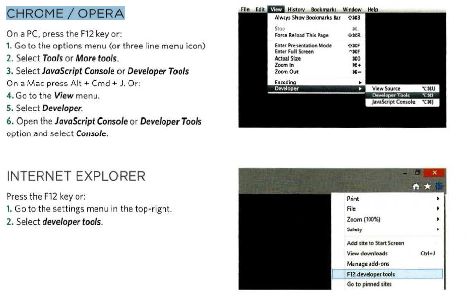
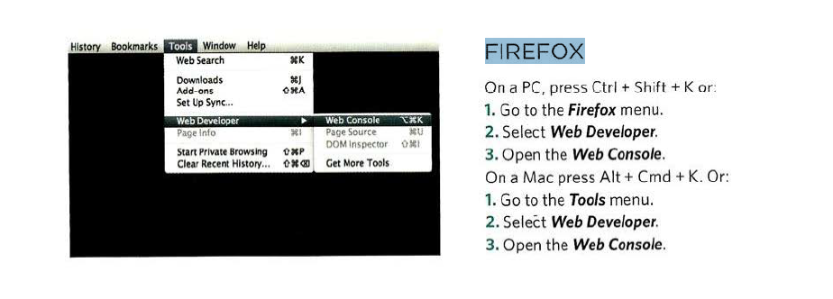
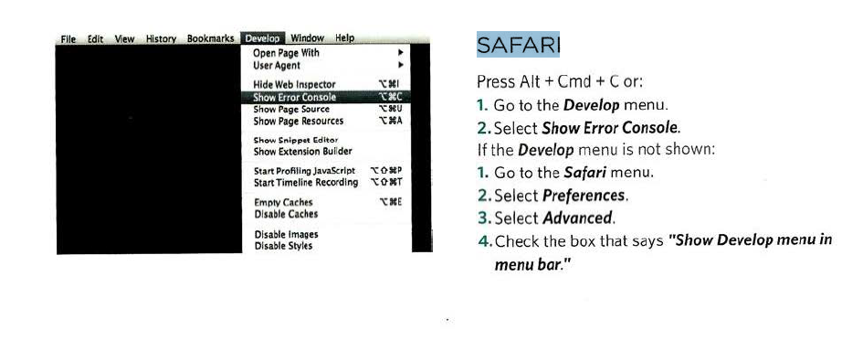

# Error Handling & Debugging    

### EXECUT.ION CONTEXTS   

* GLOBAL CONTEXT  
> Code that is in the script, but not in a function.
There is only one global context in any page.  

* FUNCTION CONTEXT   
> Code that is being run within a function.
Each function has its own function context.   

* EVAL CONTEXT   
> Text is executed like code in an internal function
called eval ().   

### VARIABLE SCOPE   

* GLOBAL SCOPE  
> If a variable is declared outside a function, it can
be used anywhere because it has global scope.
If you do not use the var keyword when creating
a variable, it is placed in global scope.   

* FUNCTION-LEVEL SCOPE  
> When a variable is declared within a function,
it can only be used within that function. This is
because it has function-level scope.  

### EXECUTION CONTEXT & HOISTING   

* PREPARE   
> The new scope is created   
> Variables, functions, and arguments are created   
> The value of the this keyword is determined    

* EXECUTE  
> Now it can assign values to variables  
> Reference functions and run their code  
> Execute statements   

### ERRORS

If a JavaScript statement generates an error, then it throws an exception.  
At that point, the interpreter stops and looks for exception-handling code.  

* ERROR OBJECTS   

When an Er ror object is created, it will contain the
following properties:   

    
> quoted from Ductte HtMl book   

When there is an error, you can see all of this
information in the JavaScript console I Error console
of the browser.   

* There are seven types of built-in error objects in
JavaScript.

    
> quoted from Ductte HtMl book   

### HOW TO DEAL WITH ERRORS   

* DEBUG THE SCRIPT TO FIX ERRORS
* HANDLE ERRORS GRACEFULLY

### BROWSER DEV TOOLS & JAVASCRIPT CONSOLE   

***CHROME/ OPERA***   
 

    
> quoted from Ductte HtMl book  

***FIREFOX***    

    
> quoted from Ductte HtMl book  

***SAFARI***   

    
> quoted from Ductte HtMl book   

### CONSOLE METHODS   

* `conso1e. info()` can be used for general information  
* `consol e.warn()` can be used for warnings  
* `console .error()` can be used to hold errors  
* `console. table ()` lets you output a table showing as (objects/arrays that contain other objects or arrays).   
* `console. assert()` can test if a condition is met, and write to the console only if the expression evaluates to false.   

### DEBUGGER KEYWORD   
 You can create a breakpoint
in your code using just the
debugger keyword. When the
developer tools are open, this
will automatically create a
breakpoint.    

### THROWING ERRORS   
If you know something might cause a problem for your script, you can
generate your own errors before the interpreter creates them.

using this:
`throw new Error('message');`   

### THROW ERROR FOR NaN   
If you try to use a string in a
mathematical operation (other
than in addition), you do not get
an error, you get a special value
called NaN (not a number).    

### DEBUGGING TIPS   

> ANOTHER BROWSER   
> ADD NUMBERS  
> STRIP IT BACK  
> EXPLAINING THE CODE  
> SEARCH   
> CODE PLAYGROUNDS   
> VALIDATION TOOLS  

### COMMON ERRORS   
common errors you might find
with your scripts:   

* MISSED/ EXTRA
CHARACTERS   
* DATA TYPE ISSUES   
