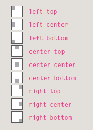
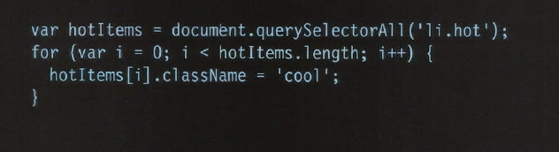
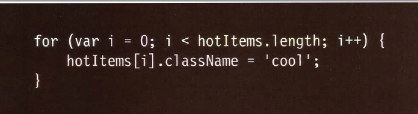

# Images    

You can an img in html by this code:
``   

### Controlling sizes   

`img.large {width: 500px; height: 500px;}`   

### AligNing images   

`img.align-left {float: left;margin-right: 10px;}`   
`img.align-right {float: right;margin-left: 10px;}`  

### Centering images    

`img.align-center {display: block;margin: 0px auto;}`
`img.medium {width: 250px;height: 250px;}`

### Background images

`background-image: url("images/pattern.gif");`    

### Repeating images   

`background-repeat: repeat;`   
`background-repeat: repeat-x;`   
`background-repeat: repeat-y;`  
`background-repeat: no-repeat;`  
`background-repeat: fixed;`  
`background-repeat: scroll;`   

### Background Position    

    
> quoted from Ductte HtMl book   

### shorthand   

we can collect all the codes in one code:   
`background: #ffffff url("images/tulip.gif")no-repeat top right;`   

# Practical Information   

### Search Engine Op timization SEO   

|----------------------|       |------------------------------|
| On-Page              |       |IdentifyKeywords and Phrases  |                 
|----------------------|       |------------------------------|                                                         
| 1: Page Title        |       |  1: Brainstorm               |  
| 2: URL / Web Address |       |  2: Organize                 |  
| 3: Headings          |       |  3: Research                 |  
| 4: Text              |       |  4: Compare                  |    
| 5: Link Text         |       |  5: Refine                   |  
| 6: Image Alt Text    |       |  6: Map                      |  
| 7: Page Descriptions |

# HTML5 video and audio    

`<video controls>`   
 `<source src="rabbit320.mp4" type="video/mp4">`   
  `<source src="rabbit320.webm" type="video/webm">`   
  `
Your browser doesn't support HTML5 video. Here is a <a href="rabbit320.mp4">link to the video</a> instead.
`   
`</video>`   

# The HTMLMediaElement API   

` HTMLMediaElement`

Part of the HTML5 spec, the HTMLMediaElement API provides features to allow you to control video and audio players programmatically — for example `HTMLMediaElement.play()`, `HTMLMediaElement.pause()`, etc. This interface is available to both `<audio>` and `<video>` elements, as the features you'll want to implement are nearly identical. Let's go through an example, adding features as we go.    

# SELECTING ELEMENTS 

### BY TAG NAME    

`get El ementsByTagName ()`   

### SELECTING ELEMENTS USING CSS SELECTORS   

`querySe1ector()`   
`querySe1ectorA11 ()`   

### Reapeting action for entire nodelist   

    
> quoted from Ductte Js book   

### LOOPING THROUGH A NODELIST   

    
> quoted from Ductte Js book   

