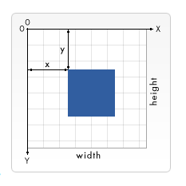

# CHART.JS    

Charts are far better for displaying data visually than tables, They’re easier to look at and convey data quickly.   

### CREATE STUNNING ANIMATED CHARTS   

* [download Chart.js](https://github.com/chartjs/Chart.js)
* create a canvas element in our HTML in which Chart.js can draw our chart   
* write a script that will retrieve the context of the canvas   
* need the canvas element for the pie chart   
* creat context   
* create the data by supply a value and a color for each section   
* add options   
* bar chart simelar to the line bar   

# The <canvas> element   

`<canvas id="" width="" height=""></canvas>`   

* the `<canvas>` element has only two attributes, width and height   
* it is easy to define some fallback content    
* requires the closing tag `</canvas>`   
* The `<canvas`> element creates a fixed-size drawing surface that exposes one or more rendering contexts   
* The canvas is initially blank. To display something, a script first needs to access the rendering context and draw on it    
* Scripts can also check for support programmatically by testing for the presence of the getContext() method   

# Drawing shapes with canvas   

* The grid   

    
> quoted from [MDN web docs](https://developer.mozilla.org/en-US/docs/Web/API/Canvas_API/Tutorial/Drawing_shapes#the_grid)    

### Drawing rectangles   

Draws a filled rectangle  `fillRect(x, y, width, height)`  

Draws a rectangular outline `strokeRect(x, y, width, height)`  

Clears the specified rectangular area, making it fully transparent `clearRect(x, y, width, height)`  

### Drawing paths  

Creates a new path `beginPath()`  

Methods to set different paths for objects  `Path methods`  

Adds a straight line to the path  `closePath()`  

Draws the shape by stroking its outline `stroke()`  

Draws a solid shape by filling the path's content area `fill()`  

also we can :

#### Drawing a triangle      
#### Moving the pen   
#### Lines   
#### Arcs    
#### Making combinations   
#### Path2D objects  
 

# Applying styles and colors

* color 
there are two important properties we can use: `fillStyle` and `strokeStyle`   

* Transparency   
`globalAlpha = transparencyValue`   

* Line styles   
Sets the width of lines drawn in the future `lineWidth = value`   
Sets the appearance of the ends of lines  `lineCap = type`   
Sets the appearance of the "corners" where lines meet `lineJoin = type`   
Establishes a limit on the miter when two lines join at a sharp angle `miterLimit = value`   
Returns the current line dash pattern array containing an even number of non-negative numbers`getLineDash()`   
Sets the current line dash pattern `setLineDash(segments)`   
Specifies where to start a dash array on a line `lineDashOffset = valu`  

* Gradients   
Creates a linear gradient object with a starting point of (x1, y1) and an end point of (x2, y2).   
`createLinearGradient(x1, y1, x2, y2)`   
 
Creates a radial gradient. The parameters represent two circles, one with its center at (x1, y1) and a radius of r1, and the other with its center at (x2, y2) with a radius of r2.   
`createRadialGradient(x1, y1, r1, x2, y2, r2)`   

Creates a conic gradient object with a starting angle of angle in radians, at the position (x, y).   
`createConicGradient(angle, x, y)`   

* Patterns   
`createPattern(image, type)`   

Tiles the image in both vertical and horizontal directions `repeat`   
Tiles the image horizontally but not vertically `repeat-x`   
Tiles the image vertically but not horizontally  `repeat-y`   
Doesn't tile the image `no-repeat`   

* Shadows    
Indicates the horizontal distance the shadow should extend from the object `shadowOffsetX = float`   
Indicates the vertical distance the shadow should extend from the object `shadowOffsetY = float`   
Indicates the size of the blurring effect `shadowBlur = float`   
A standard CSS color value indicating the color of the shadow effect `shadowColor = color`   

# Drawing text   

Fills a given text at the given (x,y) position. Optionally with a maximum width to draw.   
`fillText(text, x, y [, maxWidth]`   

Strokes a given text at the given (x,y) position. Optionally with a maximum width to draw.   
`strokeText(text, x, y [, maxWidth]`   

* Styling text    
The current text style being used when drawing text `font = value`   
Text alignment setting `textAlign = value`   
Baseline alignment setting `textBaseline = value`   
Directionality `direction = value`   

* Advanced text measurements   
`measureText()`   