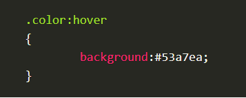

# Perfect Team    

* Things make teams source of stress   
> to make you had to prove yourself   
> team’s dynamics could put employees on edge   
>jockeying for the leadership position   
> criticized one another’s ideas   
> conflicts over who was in charge and who got to represent the group in class   
> trying to show authority by speaking louder or talking over each other   
> felt like I had to be careful not to make mistakes around them   

# CSS   

### Transform Syntax   

    
> quoted from [Shayhowe](https://learn.shayhowe.com/advanced-html-css/css-transforms/#transform-syntax)     

* 2D Transforms   
2D Rotate   
> `.box-1 {`   
>  `transform: rotate(20deg);`   
> `}`   
> `box-2 {`   
>  `transform: rotate(-55deg);`   
> `}`   

2D Scale   
> `.box-1 {`   
>  `transform: scale(.75);`   
> `}`   
> `box-2 {`   
>  `transform: scale(1.25);`   
> `}`   

 
 
2D Translate   
> `.box-1 {`   
>  `transform: translateX(-10px);`   
> `}`   
> `box-2 {`   
>  `transform: translateY(25%);`   
> `}`   
> `.box-3 {`   
> `transform: translate(-10px, 25%);`   
> `}`   
>

2D Skew   
> `.box-1 {`   
>  `transform: skewX(5deg);`   
> `}`   
> `box-2 {`   
>  `transform: skewY(-20deg);`   
> `}`   
> `.box-3 {`   
> `transform: skew(5deg, -20deg);`   
> `}`   

### Transitions     
>
>  `.box {`   
>  `background: #2db34a;`   
>  `transition-property: background;`   
>  `transition-duration: 1s;`   
>  `transition-timing-function: linear;`   
> `}`   
> `.box:hover {`   
>  `background: #ff7b29;`   
> `}`   
>

### Animations   
>   
> `@keyframes slide {`   
>  `0% {`   
>    `left: 0;`   
>    `top: 0;`   
>  `}`   
>  `50% {`   
>    `left: 244px;`   
>    `top: 100px;`   
>  `}`   
>  `100% {`   
>    `left: 488px;`   
>    `top: 0;`     
>  `}`   
> `}`   
>

### SIMPLE CSS3 TRANSITIONS   

1. Fade in    

    
> quoted from [Webdesignerdepot](https://www.webdesignerdepot.com/2014/05/8-simple-css3-transitions-that-will-wow-your-users)   

2. Change color    

    
> quoted from [Webdesignerdepot](https://www.webdesignerdepot.com/2014/05/8-simple-css3-transitions-that-will-wow-your-users)   

3. Grow & Shrink    

    
> quoted from [Webdesignerdepot](https://www.webdesignerdepot.com/2014/05/8-simple-css3-transitions-that-will-wow-your-users)   

    
> quoted from [Webdesignerdepot](https://www.webdesignerdepot.com/2014/05/8-simple-css3-transitions-that-will-wow-your-users)   

4. Rotate elements    

    
> quoted from [Webdesignerdepot](https://www.webdesignerdepot.com/2014/05/8-simple-css3-transitions-that-will-wow-your-users)   

5. Square to circle     

    
> quoted from [Webdesignerdepot](https://www.webdesignerdepot.com/2014/05/8-simple-css3-transitions-that-will-wow-your-users)   

6. 3D shadow    

    
> quoted from [Webdesignerdepot](https://www.webdesignerdepot.com/2014/05/8-simple-css3-transitions-that-will-wow-your-users)      

7. Inset border     

    
> quoted from [Webdesignerdepot](https://www.webdesignerdepot.com/2014/05/8-simple-css3-transitions-that-will-wow-your-users)      

