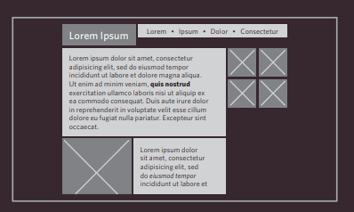
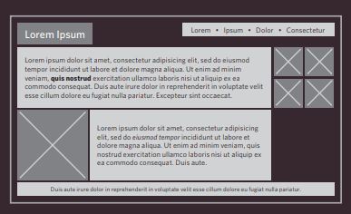

# Layout  

### Positioning Elements    

* Building Blocks   
> CSS treats each HTML element as if it is in its
own box. This box will either be a block-level
box or an inline box.   

* Containing Elements   
> If one block-level element sits inside another
block-level element then the outer box is
known as the containing or parent element.    

### Controlling the Position of Element   
> Normal flow    `position:static`  
> Relative Positioning   `position:relative`   
> Absolute positioning    `position:absolute`   
> Fixed Positioning     `position:fixed`   
> Floating Elements   `float`   

note: `z-index` property allows you to control which box appears on top.   

### Screen Sizes   
Different visitors to your site will have different sized screens that show
different amounts of information, so your design needs to be able to
work on a range of different sized screens.    

### Screen Resolution   
Resolution refers to the number of dots a screen shows per inch. Some
devices have a higher resolution than desktop computers and most
operating systems allow users to adjust the resolution of their screens.    

### Page Sizes   
Because screen sizes and display resolutions vary so much, web
designers often try to create pages of around 960-1000 pixels wide
(since most users will be able to see designs this wide on their screens).    

* Fixed Width Layouts   
    
> quoted from Ductte html book 

* Liquid Layouts   
    
> quoted from Ductte html book 

* Layout Grids    
    
> quoted from Ductte html book 

### CSS Frameworks   
CSS frameworks aim to make your life easier by providing the code for
common tasks, such as creating layout grids, styling forms, creating
printer-friendly versions of pages and so on. You can include the CSS
framework code in your projects rather than writing the CSS from scratch.    

### Multiple Style Sheets   
to link muldipe sheets use:

> `@import url("other.css"); `    
> `<link rel="stylesheet" type="text/css" href="css/site.css" />`

