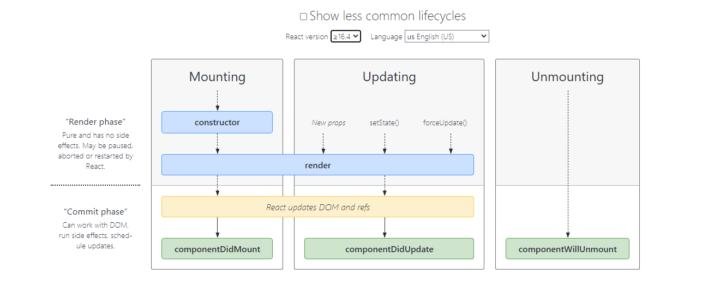

# React 

## State and Lifecycle 
* Each component has several “lifecycle methods” that you can override to run code at particular times in the process. 

  
*quoted from [NytTimes](https://projects.wojtekmaj.pl/react-lifecycle-methods-diagram/)*  

list of lifecycle methods:  
> `constructor()`  
> `static getDerivedStateFromProps()`  
> `render()`  
> `componentDidMount()`  

Updating after changes to props or state:  
> `static getDerivedStateFromProps()`  
> `shouldComponentUpdate()`  
> `render()`  
> `getSnapshotBeforeUpdate()`  
> `componentDidUpdate()`  

Unmounting  
> `componentWillUnmount()`  

Error Handling  
> `static getDerivedStateFromError()`  
> `componentDidCatch()`  

## Converting a Function to a Class  

* Create an ES6 class, with the same name, that extends React.Component.  
* Add a single empty method to it called `render()`.  
* Move the body of the function into the `render()` method.  
* Replace props with this.props in the `render()` body.  
* Delete the remaining empty function declaration.  

## Handling Events  
* Handling events with React elements is very similar to handling events on DOM elements. There are some syntax differences:  
* React events are named using camelCase, rather than lowercase.  
* With JSX you pass a function as the event handler, rather than a string.  

## Conditional Rendering  
In React, you can create distinct components that encapsulate behavior you need. Then, you can render only some of them, depending on the state of your application.  

Conditional rendering in React works the same way conditions work in JavaScript. Use JavaScript operators like `if` or the `conditional operator` to create elements representing the current state, and let React update the UI to match them.  

