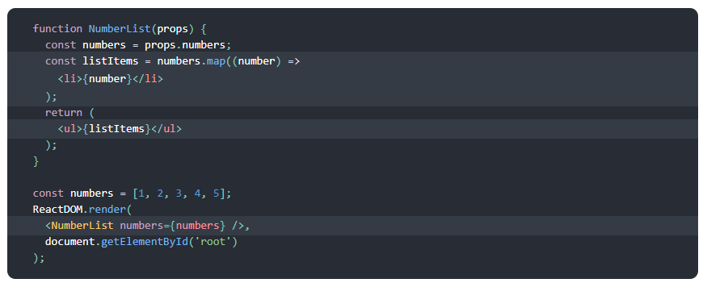
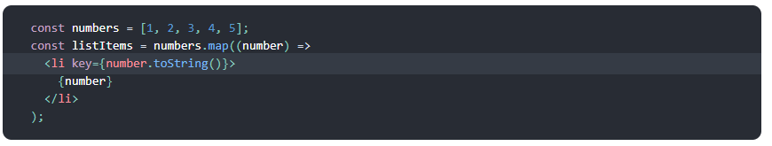

# React  

## Lists 

* To Rendering Multiple Components You can build collections of elements and `include them in JSX` using curly braces `{}`.  

### List Component  

  
> *quoted from [NytTimes](https://reactjs.org/docs/lists-and-keys.html)*  

## Keys  
* Keys help React identify which items have changed, are added, or are removed.  

Keys should be given to the elements inside the array to give the elements a stable identity:

  
*quoted from [NytTimes](https://reactjs.org/docs/lists-and-keys.html)* 

## Spread Operator  

In JavaScript, spread syntax refers to the use of an ellipsis of three dots `(…)` to expand an iterable object into the list of arguments.  

* What is ... used for?  
The spread syntax “spreads” the array into separate arguments.  

It helpful in :
-Copying an array  
-Concatenating or combining arrays  
-Using Math functions  
-Using an array as arguments  
-Adding an item to a list  
-Adding to state in React  
-Combining objects  
-Converting NodeList to an array  

