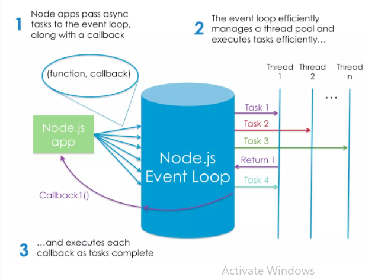

# What Is Node.js  

Node Is Built on Google Chrome’s V8 JavaScript Engine,  when we say that Node is built on the V8 engine, we don’t mean that Node programs are executed in a browser. This means that Node.js is a program we can use to execute JavaScript on our computers. In other words, it’s a JavaScript runtime.  

## What Is Node.js Used For?   

* create a sensible development environment in which some framwork can run.  
* Node.js Lets Us Run JavaScript on the Server  

  
> quoted from [Sitepoint](https://www.sitepoint.com/an-introduction-to-node-js/)

## What Kind of Apps Is Node.js Suited To?  

* Node is particularly suited to building applications that require some form of real-time interaction or collaboration   

* good fit for building APIs where you’re handling lots of requests that are I/O driven  

* for sites involving data streaming, as Node makes it possible to process files while they’re still being uploaded.  

## What Are the Advantages of Node.js?  

* speed and scalability, an often-touted advantage of using JavaScript on a web server   

* You can do everything in the same language, which, as a developer, makes you more productive 

* when you’re working with Node, data can flow neatly between layers without the need for reformatting  

* transitioning to Node development is potentially easier than to other server-side languages.  

# 6 Reasons for Pair Programming  

##  Why pair program?  
1. Greater efficiency  
2. Engaged collaboration 
3. Learning from fellow students  
4. Social skills  
5. Job interview readiness  
6. Work environment readiness  

# axios  
Promise based HTTP client for the browser and node.js  

> `npm i axios`  

## Features  
* Make XMLHttpRequests from the browser  
* Make http requests from node.js  
* Supports the Promise API  
* Intercept request and response  
* Transform request and response data  
* Cancel requests  
* Automatic transforms for JSON data  
* Client side support for protecting against XSRF  

# async and await  
These features basically act as syntactic sugar on top of promises, making asynchronous code easier to write and to read afterwards. They make async code look more like old-school synchronous code, so they're well worth learning. This article gives you what you need to know.  

>
> `async function hello() { return "Hello" };`
> `hello().then((value) => console.log(value))`
>

>
> `async function hello(){return greeting = await Promise.resolv("Hello);};`
> `hello().then(alert);`

> quoted from [MDN](https://developer.mozilla.org/en-US/docs/Learn/JavaScript/Asynchronous/Async_await)