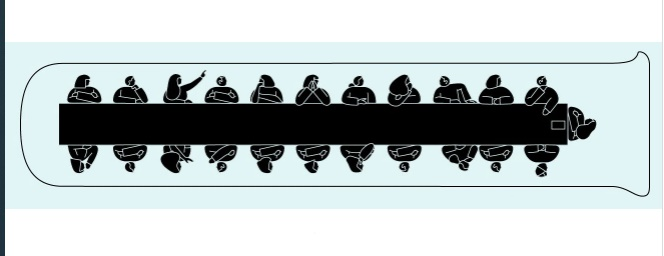

# Perfect Team

    
> quoted from [NytTimes](https://www.nytimes.com/2016/02/28/magazine/what-google-learned-from-its-quest-to-build-the-perfect-team.html)      

###  HOW TO BUILD A PERFECT TEAM

* case-competition team was always fun and easygoing.  
* the team’s members got along better as a group than as individual friends. good communication and avoiding micromanaging is critical     
* most effective teams, for instance, were composed of friends who socialized outside work. 
* when they gather, the group’s norms typically override individual proclivities and encourage deference to the team.
* to maximize the group’s score was for each person to sacrifice an item they really wanted for something the team needed.     
* wrong norms could hobble a team, even if, individually, all the members were exceptionally bright.     
* take advantage of everyone’s relative strengths.    
* the good teams all had high ‘‘average social sensitivity’’ — a fancy way of saying they were skilled at intuiting how others felt based on their tone of voice, their expressions and other nonverbal cues.   
* team climate characterized by interpersonal trust and mutual respect in which people are comfortable being themselves.   
* making sure teams had clear goals and creating a culture of dependability.    
* psychological safety, more than anything else, was critical to making a team work.    
* speak honestly about the things that had been bothering them,   
* studies show that groups tend to innovate faster, see mistakes more quickly and find better solutions to problems.   
* Studies also show that people working in teams tend to achieve better results and report higher job satisfaction.   
* study, executives said that profitability increases when workers are persuaded to collaborate more.    

----------------------
## HTTP 
That first part tells the browser what protocol to use, it is capable of describing the location of something anywhere in the world from anywhere in the world. It's the foundation of the web.  

## REST  
 provides a definition of a “resource”, which is what those things point to.  

## URL
how  the machines tells each other where things are  

