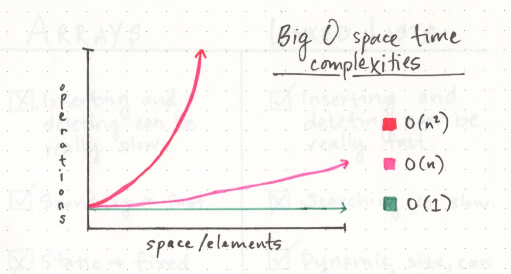
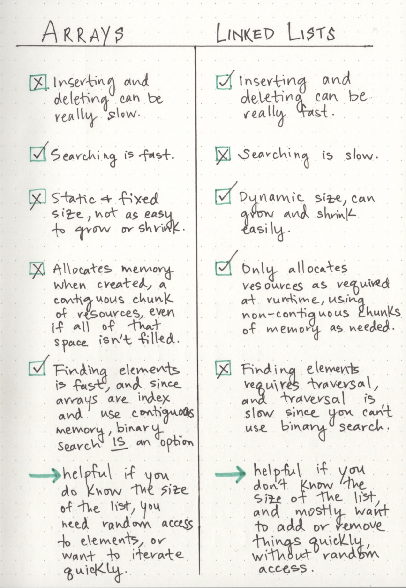

## Linked Lists  

A data structure that contains nodes that links/points to the next node in the list.   

*Types of Linked List:*  
1- Singly - means that there is only one reference, and the reference points to the Next node in a linked list.   
2- Doubly - means that there is a reference to both the Next and Previous node. 

### Traversal  

The best way to approach a traversal is through the use of a `while()` loop, This allows us to continually check that the Next node in the list is not null.   

### Linear data structures   
which means that there is a sequence and an order to how they are constructed and traversed. 

> non-linear data structures, items don’t have to be arranged in order, which means that we could traverse the data structure non-sequentially.   

### Memory management  

| array                               | linked list  |
|-------------------------------------|--------------|
|array  When an *array* is created, it needs a certain amount of memory, If we had 7 letters that we needed to store in an array, we would need 7 bytes of memory to represent that array. But, we’d need all of that memory in one contiguous block.|when a *linked list* is born, it doesn’t need 7 bytes of memory all in one place. One byte could live somewhere, while the next byte could be stored in another place in memory altogether! Linked lists don’t need to take up a single block of memory; instead, the memory that they use can be scattered throughout.|
static data structures|  dynamic data structures.|
| 

###  linked list   
- A linked list is made up of a series of nodes, which are the elements of the list. 
- The starting point of the list is a reference to the first node, which is referred to as the head.   
- A *single* node is also pretty simple. It has just two parts: data, or the information that the node contains, and a reference to the next node.   
- ll a node is concerned with is the data it contains, and which node its pointer references to the next node in the list.   
- *Singly linked lists* are the simplest type of linked list, based solely on the fact that they only go in one direction.   
- doubly linked list, have a reference pointer to its preceding node  
- *circular linked list* is a little odd in that it doesn’t end with a node pointing to a null value. 

### Big O  
- The amount of time that a function, action, or algorithm takes to run based on how many elements we pass to that function.   
 - There are a ton of different equations used to define the space and time complexity of an algorithm, and most of them involve an O (referred to as just “O” or sometimes as “order”), and a variable n, where n is the size of the input (think back to our our ten, thousands, or millions of numbers).   
 - 

   

> There are two major points to consider when thinking about how an algorithm performs: how much time it requires at runtime given how much time and memory it needs.    

***O(1)*** function takes constant time, which is to say that it doesn’t matter how many elements we have, or how huge our input is: it’ll always take the same amount of time and memory to run our algorithm.   

***O(n)*** function is linear, which means that as our input grows (from ten numbers, to ten thousand, to ten million), the space and time that we need to run that algorithm grows linearly.   

### Growing a linked list  

- we don’t need to allocate memory in advance or copy and re-create our linked list, since we won’t “run out of space” the way we might with a pre-allocated array.we really need to do is rearrange our pointers.   

### when to use linked list  
- a linked list is usually efficient when it comes to adding and removing most elements, but can be very slow to search and find a single element.   

you can find some preferences to use array vs linked list in the following pic: 

   

