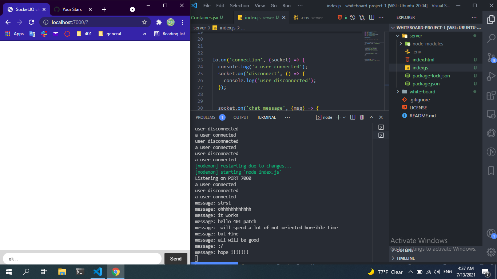
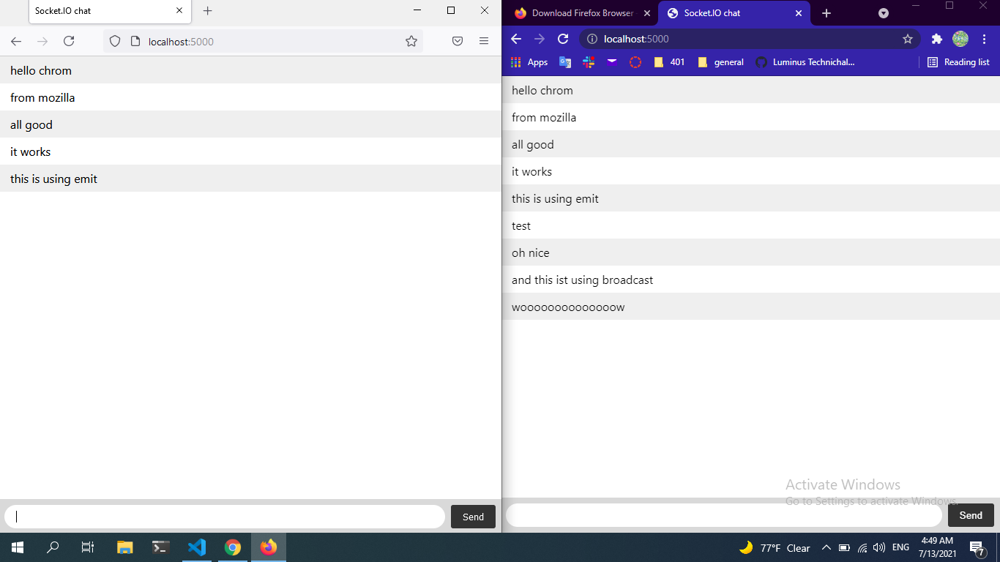

##  Review  

**What does it mean that web sockets are bidirectional? Why is this useful?**  
bidirectional communication between a client and server. This two-way flow is unique to WebSocket connections, and it means they can transfer data very quickly and efficiently.

**Does socket-io use HTTP? Why?**   
Socket-io, and WebSockets in general, require an http server for the initial upgrade handshake. So even if you don't supply Socket-io with an http server it will create one for you.


**What happens when a client emits an event?**   
Sent an event from the client!

**What happens when a server emits an event?**  
all listening client receive the event    


**What happens if a client “misses” an event?**   
event wont run in server 

**How can we mitigate this?**  
should create error handler to track the error

##  Vocabulary   

| voc                               | related to |
|-------------------------------------|--------------|
|Socket |one endpoint of a two-way communication link between two programs running on the network.|
|Web Socket|computer communications protocol, providing full-duplex communication channels over a single TCP connection.|
|Socket-io| JavaScript library for realtime web applications. It enables realtime, bi-directional communication between web clients and servers.|
|Client|Web browser in the user's machine or mobile device.|
|Server| computer program that distributes web pages as they are requisitioned. The basic objective of the web server is to store, process and deliver web pages to the users.|
|OSI Model|conceptual framework used to describe the functions of a networking system.|
|TCP Model|conceptual model and set of communications protocols used in the Internet and similar computer networks|
|TCP| stands for Transmission Control Protocol a communications standard that enables application programs and computing devices to exchange messages over a network.|
|UDP|lightweight data transport protocol that works on top of IP|
|Packets|formatted unit of data carried by a packet-switched network.|
|


## Preview  


*Which 3 things had you heard about previously and now have better clarity on?*  
- Socket
  

*Which 3 things are you hoping to learn more about in the upcoming lecture/demo?*  
-  Socket 
-   Web Socket
- real time app in general

*What are you most excited about trying to implement or see how it works?*  
- real time app in general

&nbsp;

## Preparation Materials

> Socket.io Chat Example
     
no way to prove reading, but this is a small demo 



-

&nbsp;

&nbsp;

> Rooms and Namespaces   

- A room is an arbitrary channel that sockets can join and leave.   

- join   

```
io.on('connection', socket => {
  socket.join('some room');
});
```

- Default room    >> Each Socket in Socket.IO is identified by a random, unguessable, unique identifier Socket#id.  


- leave   

```
io.on('connection', socket => {
  socket.on('disconnecting', () => {
    console.log(socket.rooms); // the Set contains at least the socket ID
  });

  socket.on('disconnect', () => {
    // socket.rooms.size === 0
  });
});
```

- multiple Socket.IO servers   

You just need to replace the default Adapter by the Redis Adapter.  


