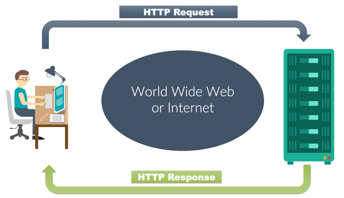

## Review

**Describe the Web-Request-Response-Cycle**

&nbsp;

&nbsp;

&nbsp;

**Explain what a “server” is, as it relates to the WRRC**  
the software which recevie req from the frontend and handel it then send resopeses

**What does it mean to “deploy” an application?**  
upload it on live cloude

## Vocabulary

| voc     | related to                                                                                       |
| ------- | ------------------------------------------------------------------------------------------------ |
| Server  | a computer or system that provides resources, data, services, or programs to other computers     |
| Pub/Sub | any message published to a topic is immediately received by all of the subscribers to the topic. |
| WRRC    | traces how a user's request flows through the app.                                               |
|         |

## Preview

_Which 3 things had you heard about previously and now have better clarity on?_

- server

_Which 3 things are you hoping to learn more about in the upcoming lecture/demo?_

- aws deployment

_What are you most excited about trying to implement or see how it works?_

- aws deployment

&nbsp;

## Preparation Materials

> Virtual Machines

- A virtual machine (VM) is a virtual environment that functions as a virtual computer system with its own CPU, memory, network interface, and storage, created on a physical hardware system

- When the VM is running and a user or program issues an instruction that requires additional resources from the physical environment, the hypervisor schedules the request to the physical system’s resources  
  &nbsp;

&nbsp;

> AWS EC2

- Amazon Elastic Compute Cloud (Amazon EC2) is a web service that provides secure, resizable compute capacity in the cloud.

- Amazon EC2’s simple web service interface allows you to obtain and configure capacity with minimal friction.

- Features :  
  Reliable, scalable, infrastructure on demand  
  Secure compute for applications  
  Flexible options to optimize cost  
  Easy to migrate and build apps

&nbsp;

&nbsp;

> Elastic Beanstalk

- WS Elastic Beanstalk is an easy-to-use service for deploying and scaling web applications and services developed with Java, .NET, PHP, Node.js, Python, Ruby, Go, and Docker on familiar servers such as Apache, Nginx, Passenger, and IIS.

- Benefits:
  Fast and simple to begin  
  Developer productivity  
  Impossible to outgrow  
  Complete resource control
