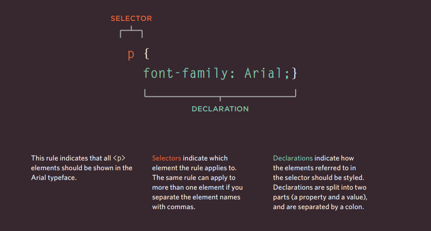
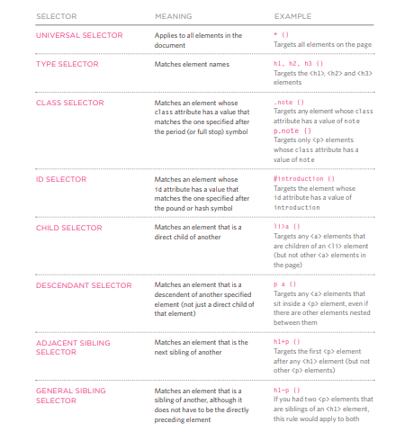

# CSS  

* CSS works is to
imagine that there is an invisible box around every HTML element.    
* CSS allows you to create rules that control the
way that each individual box (and the contents
of that box) is presented.    

# CSS consestes of two parts:  

  

# Using External CSS   

`<link href="css/styles.css" type="text/css" rel="stylesheet" />`  

 # CSS Selectors  

   

# How Css Rules Cascade

> **LAST RULE**
If the two selectors are identical,
the latter of the two will take
precedence. Here you can see
the second i selector takes
precedence over the first.   
> **SPECIFICITY**
If one selector is more specific
than the others, the more
specific rule will take precedence
over more general ones.    
*In this
example:*
`h1` is more specific than `*`  
`p b` is more specific than `p`  
`p#intro` is more specific than `p`  

# Why use External
Style Sheets?  

* All of your web pages can share
the same style sheet. This is
achieved by using the <link>
element on each HTML page of
your site to link to the same CSS
document. This means that the
same code does not need to be
repeated in every page (which
results in less code and smaller
HTML pages).   
* Therefore, once the user has
downloaded the CSS stylesheet,
the rest of the site will load
faster. If you want to make a
change to how your site appears,
you only need to edit the one
CSS file and all of your pages
will be updated.  
* The HTML code
will be easier to read and edit
because it does not have lots of
CSS rules in the same document.
It is generally considered good
practice to have the content of
the site separated from the rules
that determine how it appears.  

-------------------------------------

# color
You can chang color by many tools:   

## Background Color  

### Rgb values   
These express colors in terms
of how much red, green and
blue are used to make it up. For
example: rgb(100,100,90).   

### Hex codes   
These are six-digit codes that
represent the amount of red,
green and blue in a color,
preceded by a pound or hash #
sign. For example: #ee3e80.   

### Color names  
There are 147 predefined color
names that are recognized
by browsers. For example:
DarkCyan.   

### HSL/a Color   
The hsl color property has
been introduced in CSS3 as an
alternative way to specify colors.
The value of the property starts
with the letters hsl, followed
by individual values inside
parentheses for:   
**hue**
This is expressed as an angle
(between 0 and 360 degrees).  
**saturation**
This is expressed as a
percentage.    
**lightness**
This is expressed as a
percentage with 0% being white,
50% being normal, and 100%
being black.      
**alpha**
This is expressed as a
number between 0 and 1.0.
For example, 0.5 represents
50% transparency, and 0.75
represents 75% transparency.   

## Contrast  

When picking foreground and background
colors, it is important to ensure that there is
enough contrast for the text to be legible.   

## Opacity   
CSS3 introduces the opacity
property which allows you to
specify the opacity of an element
and any of its child elements.
The value is a number between
0.0 and 1.0 (so a value of 0.5
is 50% opacity and 0.15 is 15%
opacity).   

## 

