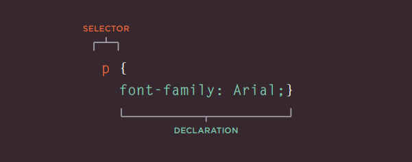
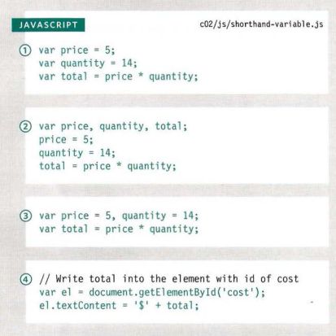
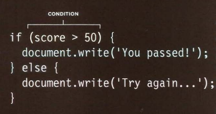

# HTML TEXT    

### Structural markup   

| Structural markup  | Code                                      |  Uses                                           |
|--------------------|-------------------------------------------|-------------------------------------------------|
| Headings           | `<h1>` `<h2>` `<h3>` `<h4>` `<h5>` `<h>6` |  `<h1>` is the biggest to  `<h6>` the smallest. |
| Paragraphs         |  `
`                                    | Use for spacify a paragraph                     |
| Bold               |  `<b>`                                    | To make text bold                               |
| Italic             |  `<i>`                                    | To make text italic                             |
| superscript        |  ``                                  | To draw text as a power                         |
| subscript          |  ``                                  | To draw a text as a foot note                   |
| Line breakes       |  ` `                                 | show each paragraph in a line alone             |
| Horizontal rule    |  `
`                                 | Drow a line between paragraphs                  |

### Semantic markup   

| Semantic markup    | Code                              |  Uses                                           |
|--------------------|-----------------------------------|-------------------------------------------------|
| Strong             | `<strong>`                        | indecate important content                      |
| Emphasis           |  `<em>`                           | indecate that the word change the meaning       |
| Quotation          |  `<blockquote>`                   | long quotation                                  |
|                    |  `<q>`                            | short quotation                                 |
| Abbreviation       |  `<abbr>`                         | make abbreviation or an acronym                 |
| Acronym            |  `<acronym>`                      | separated acronym                               |
| Citation           |  `<cite>`                         | to add referance                                |
| Definitions        |  `<dfn>`                          | to define terms                                 |
| Auther details     |  `<address>`                      | to add Contact                                  |
| Change to contant  |  `<ins>`                          | draw underline                                  |
|                    |  `<del>`                          | draw a line through the word                    |
|                    |  `<s>`                            | show no accuret word                            |

# CSS

### BLOCK & 
> ` <h1> , <h6>, 
 , 
 `  

### INLINE ELEMENTS  
> ` <b>, <i>, , <em> , `  

## Inline style : Css Rule   

  
>quted from Ductte html book

## External style   

* when use css external file, you should link it with HTML file to display.  

> we add `<link>` element in the `<head>` of the html to link both files  
>
> using 3 attributes:  
> `href` indecate the path of css file    
> `type` indecate the type of the file (text/css)  
> `rel`  indecate the relationship between the 2 files (stylesheet)  
 

## Internal style   

> you can add a `<style>` tag in the `<head>` of the html and style the html by taging the selector   

  
>quted from Ductte html book

### How Css Rules Cascade   
* if 2 selector identecal the latest one will cascade     
* if one is more specify, it will cascade first     
* you can add `!` after any property value to indecate importance, it will cascade first   

# JavaScript   

| JS rules           | Code                                       |  Uses                                           |
|--------------------|--------------------------------------------|-------------------------------------------------|
| COMMENTS           | `/* ------ */`                             | indecate a long comment                         |
|                    |  `// ---- `                                | indecate one line comment                       |
| Variable           |  `var quantity = value ;`                  | to store all data types (num, str, bool)        |
| ARRAYS             | `var name ['abeer', 'ahmad', 'anas'];`     | to store list of value                          |
| expression         |  only assign a value in a variable                                                           |
| Operator           |  creating value from one or more value                                                       | 

### variable can assign value by many ways:    

   
>quted from Ductte JS book   

# DECISIONS   

  
>quted from Ductte JS book   

### Comparison operator

| operator                 | Code                          |
|--------------------------|-------------------------------|
| equal to                 |  `==`                         |
| it not equal to          |  `!=`                         |
| strict equal to          |  `===`                        | 
| strict not equal to      |  `!===`                       | 
| greater than             |  `>`                          | 
| less than                |  `<`                          | 
| greater than or equal to |  `>=`                         | 
| less than or equal to    |  `<=`                         |  
| AND                      |  `&&`                         | 
| OR                       |  ` || `                       | 
| ROT                      |  `!`                          | 

# How to Write a Git Commit Message

* separate subjecta from it's body by space  
* don't make it longer than 50 characters  
* make the subject capital  
* don't leave space after the subject  
* make the subject imparative   
* wrag after the 72 character in the body   
* body used to show what and why not how

