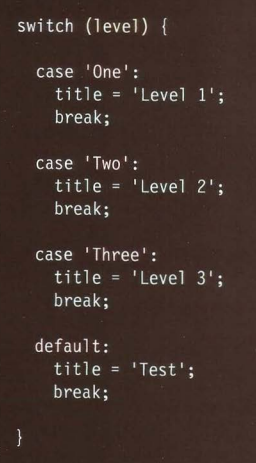
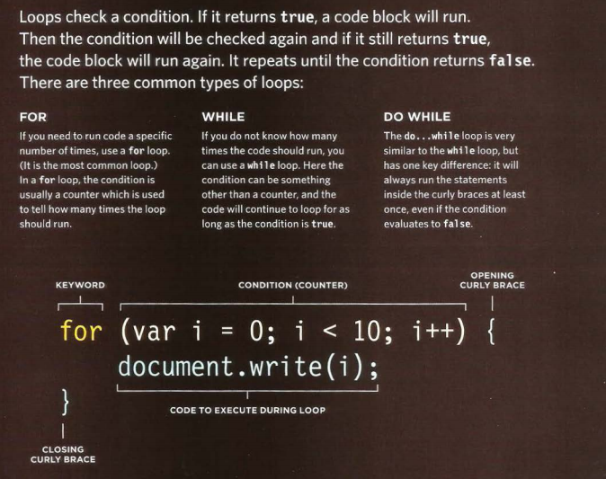

# LISTS

* Ordered lists    
> use `<ol><li></li></ol>`  

* Unordered lists  
> use `<ul><li></li></ul>`  

* Definition lists  
> use `<dl><dt></dt></dl>` or `<dl><dd></dt></dd>`  

* Nested list  
> use alist inside another list   

# BOXES  

| boxes spacification      | Code                          |
|--------------------------|-------------------------------|
| Box Dimension            |  `width, height`              |
| Limiting Width           |  `min-width, max-width`       |
| Limiting Height          |  `min-height, max-height`     | 
| Overflowing Content      |  `overflow`                   | 
| Border Width             |  `border-width`               | 
| Border Style             |  `border-style`               | 
| Border Color             |  `border-color`               | 
| Shorthand                |  `border`                     |  
| Padding                  |  `padding`                    | 
| Margin                   |  ` margin `                   | 
| Change Inline/Block      |  `display`                    | 
| Hiding Boxes             |  `visibility`                 |
| Border Images            | `border-image`                |
| Box Shadows              | `box-shadow`                  |
| Rounded Corners          | `border-radius`               |
| Elliptical Shapes        | `border-radius`               |

# SWITCH STATEMENTS

* switch statement used for presenteing a different
message depending on which
level the user at, The message is
stored in a variable called msg. 

## formate

>quoted from Ductte JS book 

# LOOP

>quoted from Ductte JS book 

