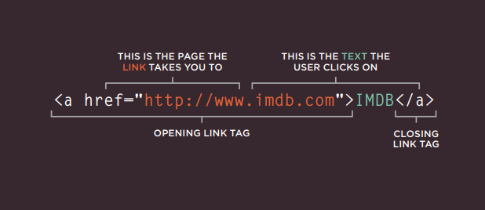
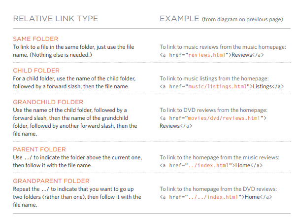
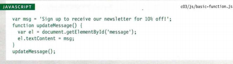
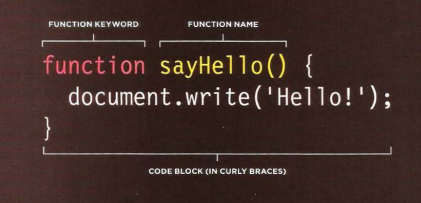
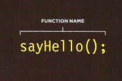

# Writing Links

> links may take you to site or to the other pages in the same website.

### How to link   

    
> quoted from Ductte html book

> when you want to link other html page in the same file, you don't need to put the domain name, only put the relative URL.   

### Directory Structure

   
> quoted from Ductte html book

### Email Links  

> you can link Email with this code:
>
> `<a href="mailto:name@example.org">Email</a>`

### Opening Links in a New Window  

> You can use `<a href="-----" target="_blank">` to open the link in another page.  

### Linking to a Specific Part of the Same Page   

> uring the `id` attribute,  `<a href="#idname">`   

### Linking to a Specific Part of Another Page

> fist put the page url then ad `#` and the `id` :
>
>  `<a href="webpage url/#idname">`

---------------------------
# Layout   

 Block-level elements
Inline elements
Containing Elements

### Controlling the Position of Elements   

| Normal flow                                 | `position:static`          |
| Relative Positioning                        | `position:relative`        |
| Absolute positioning                        | `position:absolute`        |
| Fixed Positioning                           | `position:fixed`           |
| Floating Elements                           | `float`                    |
| Overlapping Elements                        | `z-index`                  |
| Clearing Floats                             | `clear`                    |
| Creating Multi-ColumnLayouts with Floats    | `width`, `float`, `margin` |

### Type of Layouts  
* Fixed Width Layouts  
* Liquid Layouts  
* Layout Grids  
* CSS Frameworks  

----------------------------

# FUNCTION

* A BASIC FUNCTION   
   
> quoted from Ductte JS book  

* Declaring function   
   
> quoted from Ductte JS book   

* Calling function   
   
> quoted from Ductte JS book   

### VARIABLE SCOPE 
* LOCAL VARIABLES 
* GLOBAL VARIABLES 

# 6 Reasons for Pair Programming

1. Maximize efficiency
2. Engaged collaboration
3. Helpping in Learn from others
4. Develope the Social skills
5. Ready forJob interview 
6. Ready for Work environment 
